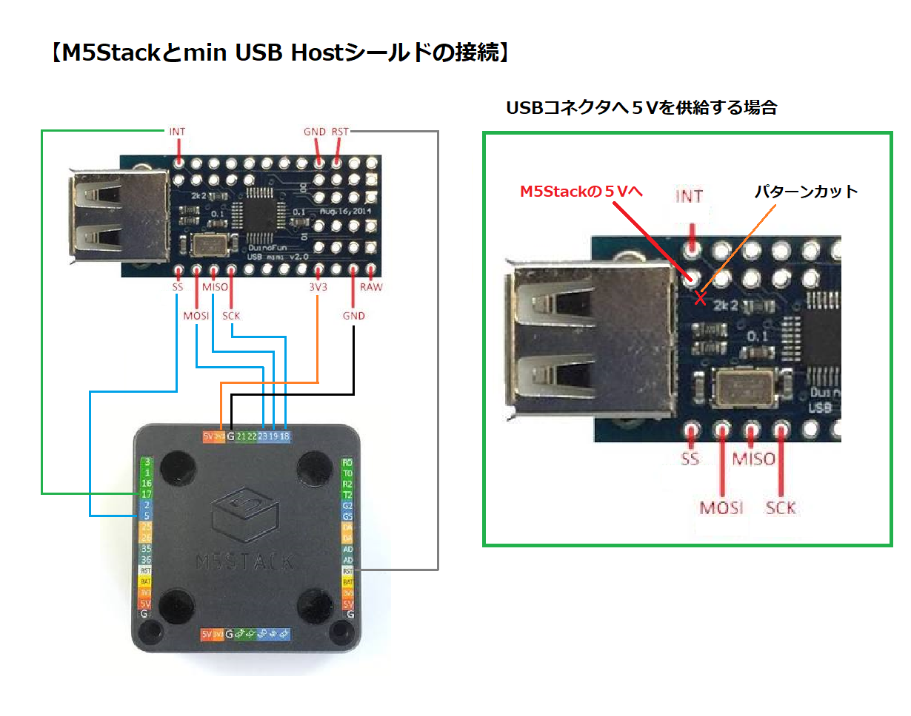

# M5Stack_TinyBasicPlus_UsbKbd
M5Stack_TinyBasicPlusをUSB HostシールドでUSBキーボード対応にしました。

オリジナルはこちら。 
M5Stack_TinyBasicPlus <https://github.com/0x1abin/M5Stack_TinyBasicPlus> 

---
### 注意事項 ###
* BackSpaceキー未対応です。
* EEPROMの動作未確認です。
* SDの動作未確認です。
  

### 必要な物 ###
* [M5Stack](http://www.m5stack.com/ "Title") (Grayで動作確認をしました。) 
* Arduino IDE (1.8.5で動作確認をしました。) 
* [Arduino core for the ESP32](https://github.com/espressif/arduino-esp32 "Title")
* [M5Stack Library](https://github.com/m5stack/M5Stack.git "Title")
* [USB Host Library Rev.2.0](https://github.com/felis/USB_Host_Shield_2.0 "Title")
* [Mini USB Host Shield](https://www.circuitsathome.com/usb-host-shield-hardware-manual/ "Title")
* [QueueArray Library For Arduino](https://playground.arduino.cc/Code/QueueArray "Title")  

   
